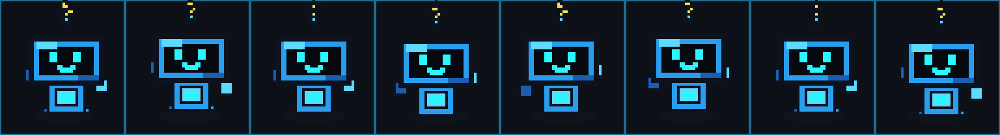
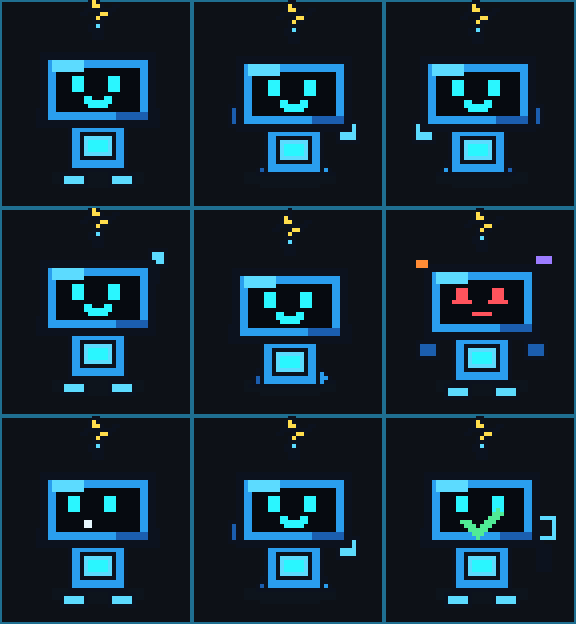
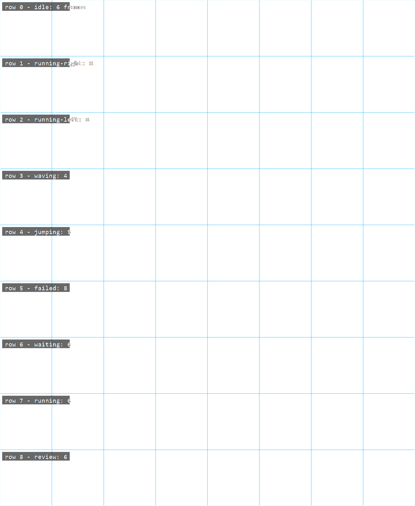

# CodexPets

Templates, notes, and starter assets for making custom Codex pet avatars.

Codex pets are the small visual companions shown in the Codex app or extension pet overlay. A custom pet is a sprite-sheet avatar plus a small manifest file.

## Preview

This repo includes an original Spark demo pet so the expected animation format is visible without copying bundled Codex artwork.

<p>
  
</p>

Running-right frames:



State sampler:



## What A Pet Is

A pet changes the visual companion shown in Settings > Appearance > Pets. It does not change Codex's model, reasoning, or coding behavior.

## Folder Format

On Windows, custom pets are loaded from:

```text
%USERPROFILE%\.codex\pets
```

Each pet gets its own folder:

```text
%USERPROFILE%\.codex\pets\my-pet\
  pet.json
  spritesheet.webp
```

`pet.json`:

```json
{
  "displayName": "My Pet",
  "description": "A short line shown in the pet picker.",
  "spritesheetPath": "spritesheet.webp"
}
```

The loader also accepts an optional `id`, but the UI id is based on the folder name as `custom:<folder-name>`, so choose a clean folder name.

## Sprite Sheet Rules

The sprite sheet must be:

- PNG or WebP.
- Exactly `1536x1872`.
- A grid of `8` columns by `9` rows.
- Each frame is `192x208`.

See `templates/spritesheet-layout.md` for the animation row map.



The guide image shows the required `8` by `9` sheet. Use it as a reference only; final pet sprite sheets should contain just the pet artwork on transparency.

## Built-In Pet Reference

The Codex extension currently includes these bundled pets:

| Pet | Description |
| --- | --- |
| Codex | The original Codex companion. |
| Dewey | A tidy duck for calm workspace days. |
| Fireball | Hot path energy for fast iteration. |
| Rocky | A steady rock when the diff gets large. |
| Seedy | Small green shoots for new ideas. |
| Stacky | A balanced stack for deep work. |
| BSOD | A tiny blue-screen companion. |
| Null Signal | Quiet signal from the void. |

Their sprite sheets may be installed locally under:

```text
%USERPROFILE%\.vscode\extensions\openai.chatgpt-*\webview\assets
```

Those bundled images are useful references for frame spacing, scale, and animation timing. They are not copied into this repo.

## Try A Pet

1. Create a folder under `%USERPROFILE%\.codex\pets`.
2. Add `pet.json` and a valid `spritesheet.webp` or `spritesheet.png`.
3. Open Codex Settings > Appearance > Pets.
4. Click `Refresh`.
5. Select the custom pet.

If a pet does not appear, the most common reason is that the sprite sheet is not exactly `1536x1872`.

## Local Art Tool

Pixelorama is a good open-source pixel-art editor for this project. If you keep a local portable copy, put it under `tools/`; that folder is ignored by Git.

This workspace currently uses:

```text
tools\Pixelorama-v1.1.10\Pixelorama-Windows-64bit\Pixelorama.exe
```

Use it to draw frames, animate them, and export artwork for the Codex sprite sheet.

## Current Draft

The Spark starter draft lives here:

```text
art\spark\
  pet.json
  spritesheet.png
  spritesheet-guide.png
```

`spritesheet.png` contains the original Spark demo animation sheet. Keep `spritesheet-guide.png` as a reference only; it has labels and grid lines baked into the image.

Custom pet support was discovered from the local Codex extension behavior and may change as Codex updates.
